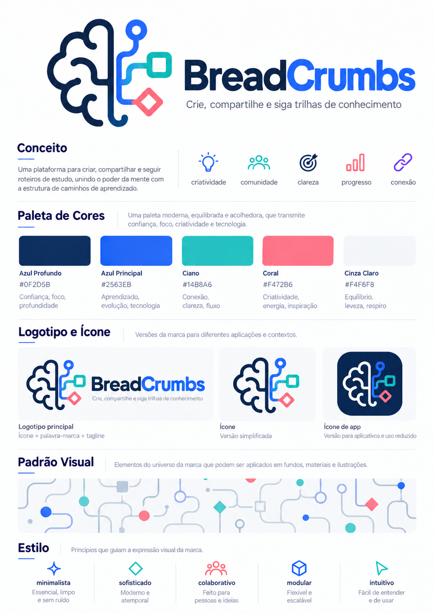
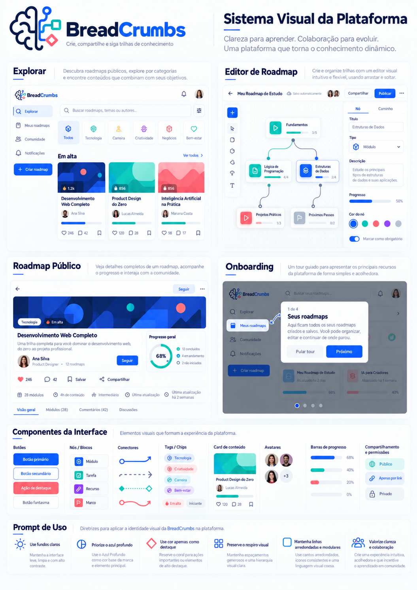
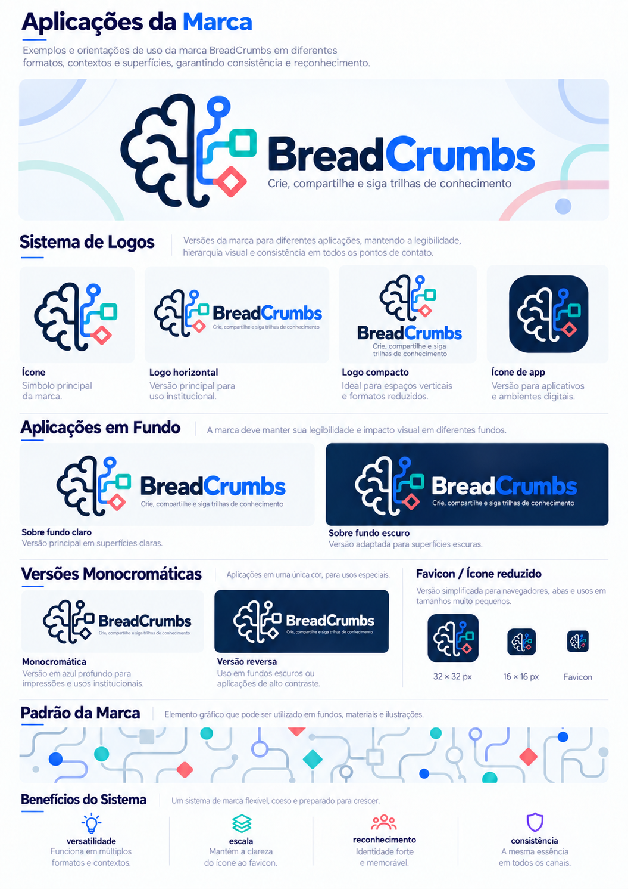

# BreadCrumbs — guia visual inicial

As três imagens fornecidas pelo usuário são **referências oficiais iniciais**, não apenas inspiração. Este documento registra sua aplicação futura. Não foram criados componentes, tokens de runtime ou telas de produto nesta etapa.

Nome: **BreadCrumbs**. Tagline: **Crie, compartilhe e siga trilhas de conhecimento**.

## Fontes preservadas

As imagens foram copiadas integralmente para o repositório, sem recorte, redesenho ou alteração. Os nomes curtos servem apenas à organização dos arquivos.

| Arquivo local                                     | Nome original                                       | Papel                                             |
| ------------------------------------------------- | --------------------------------------------------- | ------------------------------------------------- |
| [01-identidade.png](references/01-identidade.png) | Imagem do ChatGPT 1 de out. de 2026, 22_54_24-1.png | Conceito, paleta, logotipo, símbolo e estilo.     |
| [02-plataforma.png](references/02-plataforma.png) | Imagem do ChatGPT 1 de out. de 2026, 22_54_25-2.png | Composição das telas e linguagem dos componentes. |
| [03-aplicacoes.png](references/03-aplicacoes.png) | Imagem do ChatGPT 1 de out. de 2026, 22_54_26-3.png | Variações da marca, fundos, favicon e padrões.    |

SHA-256 das cópias, conferidos com os originais:

```text
01-identidade.png  895F2297C69F507FF1CE8561B85995BB2BF9FA312A9DB724777836212E6AA3FC
02-plataforma.png  F129208408A7DD0D450B4B34A62A6DFBC47FE85B0F7CFE0F5A69B865907050C9
03-aplicacoes.png  77153AE3D5EC515EBA20B38C4A22C061F6A102DB83C550BBF40773DC60BD2890
```

## Paleta e papéis

Os valores abaixo são a base fornecida no brief. As amostras raster podem apresentar variações de renderização; não substituir silenciosamente esses valores por cores extraídas da imagem.

| Nome do brief  | Cor       | Aplicação orientadora                            |
| -------------- | --------- | ------------------------------------------------ |
| Azul Profundo  | `#0F2D5B` | Marca, títulos, texto de destaque e contraste.   |
| Azul Principal | `#2563EB` | Ação principal, seleção e destaque de navegação. |
| Ciano          | `#14B8A6` | Conexão, fluxo e elementos de apoio.             |
| Coral          | `#F472B6` | Destaques pontuais, sem dominar a interface.     |
| Cinza Claro    | `#F4F6F8` | Superfícies leves e separação discreta.          |

“Ciano” e “Coral” mantêm os nomes do usuário, inclusive quando a percepção do matiz divergir do nome. Cores de apoio só devem surgir quando necessárias e coerentes com o conjunto. Não há ainda uma paleta semântica completa de erro, sucesso, alerta, hover ou desabilitado.

O tema inicial é **claro**. Versões da marca para fundos escuros e o ícone de aplicativo escuro são aplicações do logotipo; não especificam um tema escuro da plataforma.

## Linguagem e composição

| Elemento            | Direção extraída das referências                                                                                                                          |
| ------------------- | --------------------------------------------------------------------------------------------------------------------------------------------------------- |
| Marca               | Símbolo que combina cérebro e caminhos/conexões; palavra-marca com Bread em azul profundo e Crumbs em azul principal. Preservar proporção e legibilidade. |
| Superfícies         | Fundos claros, cartões e painéis delimitados com sutileza, cantos arredondados e sombras leves.                                                           |
| Hierarquia          | Títulos fortes, textos auxiliares discretos, agrupamentos claros e bastante espaço entre áreas.                                                           |
| Navegação           | Sidebar e barra superior; destaque identificável da área ativa; ações principais fáceis de localizar.                                                     |
| Explorar            | Busca e categorias com chips, seguidas de coleções de cards com conteúdo, autoria e informações de interação.                                             |
| Editor              | Canvas central, ferramentas laterais, painel de propriedades contextual e ações no topo. Nós e conexões devem permanecer legíveis com seleção e zoom.     |
| Roadmap público     | Capa, título, autoria, ações, metadados, progresso e seções de conteúdo com hierarquia clara.                                                             |
| Onboarding          | Destaque do alvo, explicação curta, posição no tour e ações compreensíveis. A imagem exemplifica a apresentação, não define regras de conclusão.          |
| Componentes         | Botões primário, secundário e discreto; inputs, cards, tags, avatares, barras de progresso, nós, conectores e controles de compartilhamento consistentes. |
| Padrões decorativos | Linhas curvas e modulares, círculos, quadrados e losangos associados a caminhos. Usar sem competir com o conteúdo.                                        |

As imagens orientam proporções, espaçamentos e arredondamentos. A família tipográfica, tamanhos exatos, escala de espaçamento, raios e breakpoints não estão formalizados; serão documentados ao implementar o design system. Não se presume fidelidade pixel a pixel de layouts ainda não construídos.

Componentes ausentes nas imagens devem estender os mesmos padrões. Seus estados de foco, hover, seleção, erro, sucesso e desabilitado precisam ser especificados na etapa de interface. Dados, nomes, percentuais, categorias e contagens nos mockups são exemplos visuais, não dados iniciais nem regras de negócio.

Para uso em produção, ainda é necessário estabelecer os arquivos individuais da marca e suas versões vetoriais oficiais. Os painéis raster preservados não são um pacote de logos pronto para publicar; não houve reconstrução automática do símbolo ou extração de fonte.

## Acessibilidade a aplicar na implementação

Propõe-se WCAG 2.2 nível AA como referência técnica de validação, sem alegar conformidade de uma interface ainda inexistente. Usar HTML semântico, labels, foco visível, teclado e informação adicional à cor. A paleta sozinha não garante contraste em todas as combinações.

Contrastes calculados pela luminância relativa sRGB para cores sólidas, sem transparência:

| Texto / fundo           | Razão aproximada | Uso orientador                                                                    |
| ----------------------- | ---------------- | --------------------------------------------------------------------------------- |
| Azul Profundo / branco  | 13,58:1          | Adequado para texto normal no critério de contraste AA.                           |
| Azul Principal / branco | 5,17:1           | Adequado para texto normal; a razão também vale para branco sobre azul principal. |
| Branco / Ciano          | 2,49:1           | Insuficiente para texto normal e grande.                                          |
| Branco / Coral          | 2,65:1           | Insuficiente para texto normal e grande.                                          |
| Azul Profundo / Ciano   | 5,45:1           | Alternativa para texto normal.                                                    |
| Azul Profundo / Coral   | 5,13:1           | Alternativa para texto normal.                                                    |

O critério AA exige pelo menos 4,5:1 para texto normal e 3:1 para texto grande. “Grande” significa 18 pt, aproximadamente 24 CSS px, ou 14 pt em negrito, aproximadamente 18,67 CSS px. A validação final também precisa considerar estados, transparências, fundos reais e componentes não textuais. [W3C: contraste mínimo](https://www.w3.org/WAI/WCAG22/Understanding/contrast-minimum.html).

O editor deve oferecer navegação e ações por teclado, além de alternativas com ponteiro que não exijam arrastar, como selecionar um nó e acionar um comando de conexão. Esses dois requisitos são distintos. O comportamento exato será desenhado com o editor. [W3C: movimentos de arrastar](https://www.w3.org/WAI/WCAG22/Understanding/dragging-movements.html).

## Referências visuais

### Identidade



### Plataforma



### Aplicações da marca


